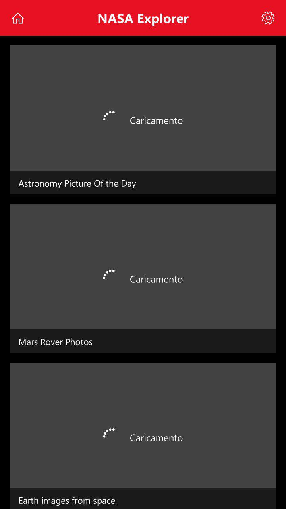
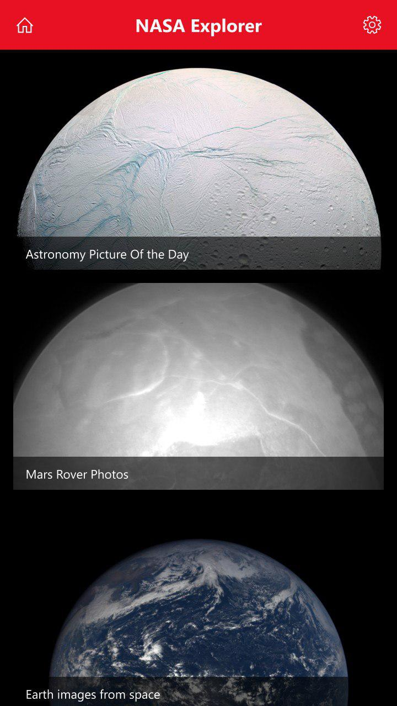
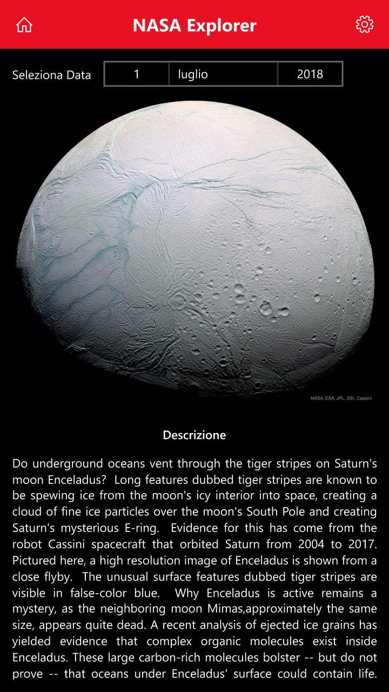
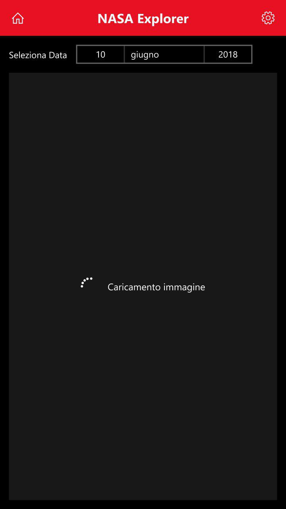
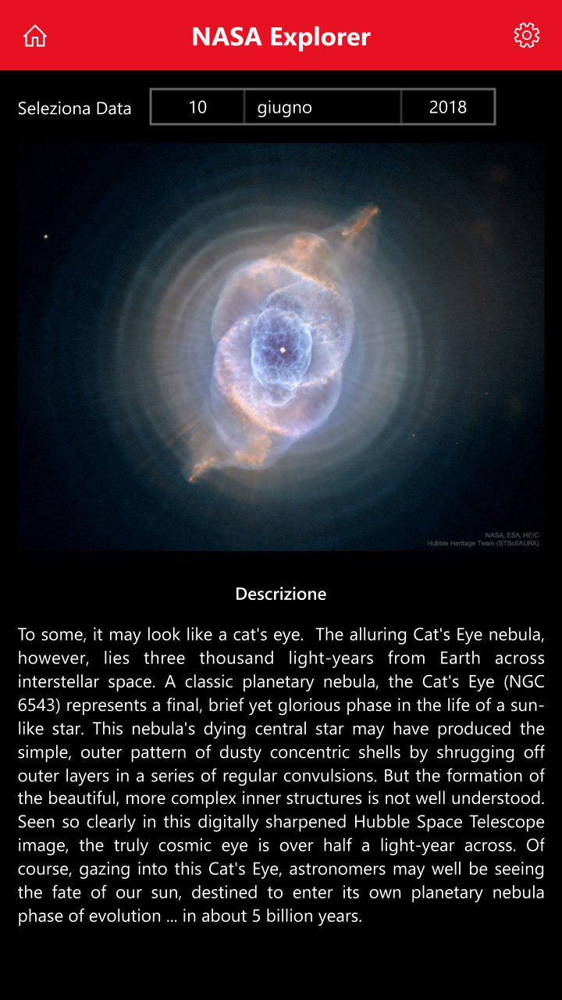
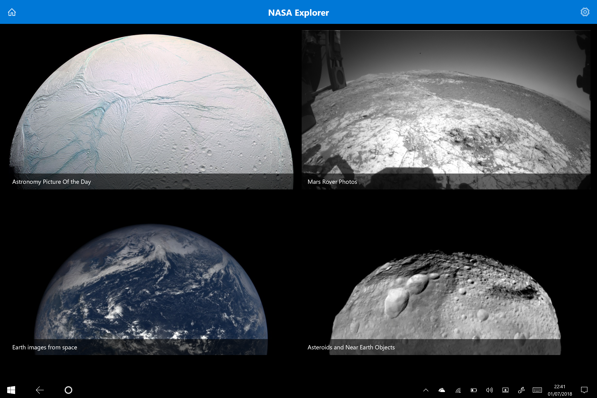

# Nasa Explorer
Visualizza le foto della Nasa grazie all'App UWP

## Home

<table style="border: 1px solid transparent">
<!--<tr>
  <th> Avvio </th><th> Caricamento immagini </th><th> Home </th>
</tr>-->
<tr>
  <th> </img> </th>  
  <th> </img> </th>
  <th> </img> </th>
</tr>
</table>

 

## APOD - Astronomy Picture Of the Day

<table style="border: 1px solid transparent">
<!--<tr>
  <th> APOD </th><th> Caricamento immagine </th><th> APOD di altra data </th>
</tr>-->
<tr>
  <th> </img> </th>  
  <th> </img> </th>
  <th> </img> </th>
</tr>
</table>

 

## Versione per Windows 10 Desktop

</img>

  

### Info
<a href="https://api.nasa.gov/" target="_blank">NASA API</a>
